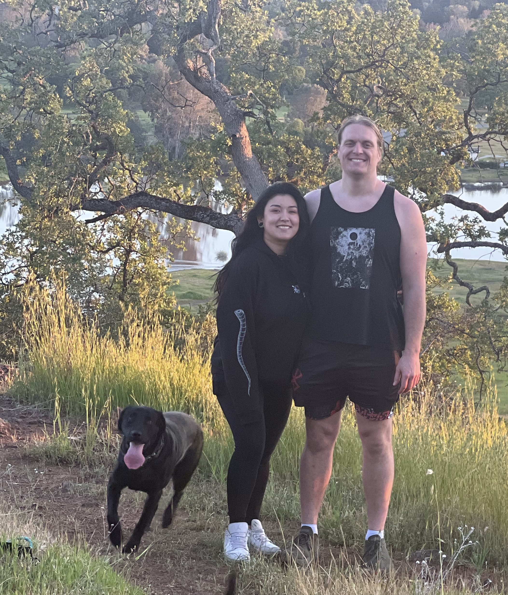
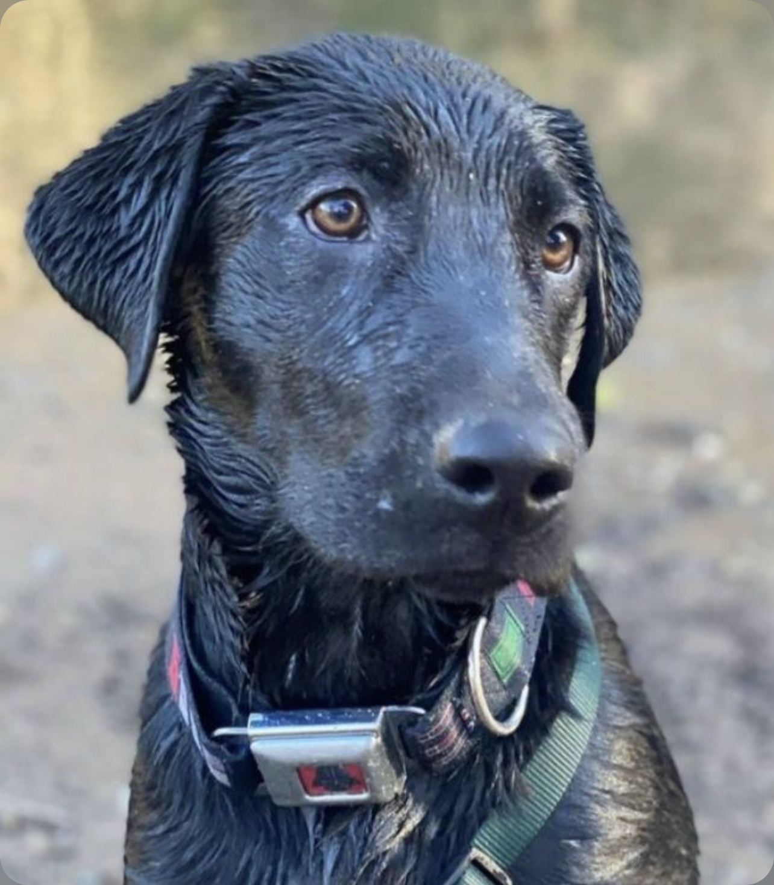

# Sarah's UX Portfolio

I am a computer science student with only a couple semesters left to go! I decided to take the Usability Engineering class because I was curious and heard nothing but good things about it. Looking forward to a productive semester!

Here's a picture of my partner Mike and I:

Here's a picture of my dog Reshi:

## UX Team Project

[Dynamic Scheduler]([https://github.com/ChicoState/ux-DynamicScheduler](https://chicostate.github.io/ux-DynamicScheduler/))

## UX Journal

[Notifications from Microsoft Teams](j01/)
